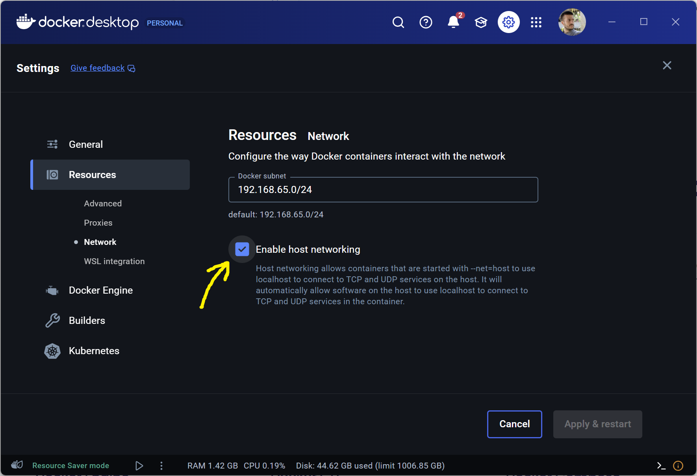

Technical preview of the Kvasir Data Storage Server

# Running with Docker Compose

The fastest way to get a dev server (with persistent storage) up and running is to use Docker Compose.

## Prerequisite

In the **Docker Desktop** application, go to `Settings` (top right cogwheel icon) and check `Enable host networking` under the `Resources > Network` section.



## Run docker compose

Clone this repository and run the following commands:

```bash
cd .deployment/docker-compose
docker compose up -d
```

This will automatically create a pod at `http://localhost:8080/alice` for you to play with.
The settings for this pod can be modified via the file `application.yaml` in the `kvasir-config` folder.

It also starts the Kvasir-UI at `http://localhost:8081`. You can select a pod to play with (`alice`).
To log in, use the temporary credentials `alice:alice`. You will be prompted to change them on first login.

# Running on Kubernetes
(A guide will be added in the future)

# Running in dev mode

If you want to experiment with modifications to the code, you can run the server in dev mode via the Maven wrapper.
This requires you to have Java JDK 21 installed.

```bash
docker compose up -d
./mvnw compile quarkus:dev
```

# Documentation

Visit the documentation pages
at [https://ibcndevs.pages.ilabt.imec.be/solid/kvasir-next/](https://ibcndevs.pages.ilabt.imec.be/solid/kvasir-next/).

# Issues

The project is still in a very early stage of development, so there are many issues and missing features. If you find
any, please report them in the [Issues](https://gitlab.ilabt.imec.be/kvasir/kvasir-server/-/issues) section.

# Future Work

* Decentralized authentication and authorization (waiting to integrate with the Knows UMA Policy Server implementation)
* Complete the GraphQL query model with more advanced features
* Complete the subgraph (Slices) prototype implementation
* Provide a decent cursor-based pagination mechanism
  * E.g. via Link headers for REST APIs (Changes API, Slices API)
  * E.g. via Relay-style pagination for GraphQL APIs
* Optimize and harden the current prototype